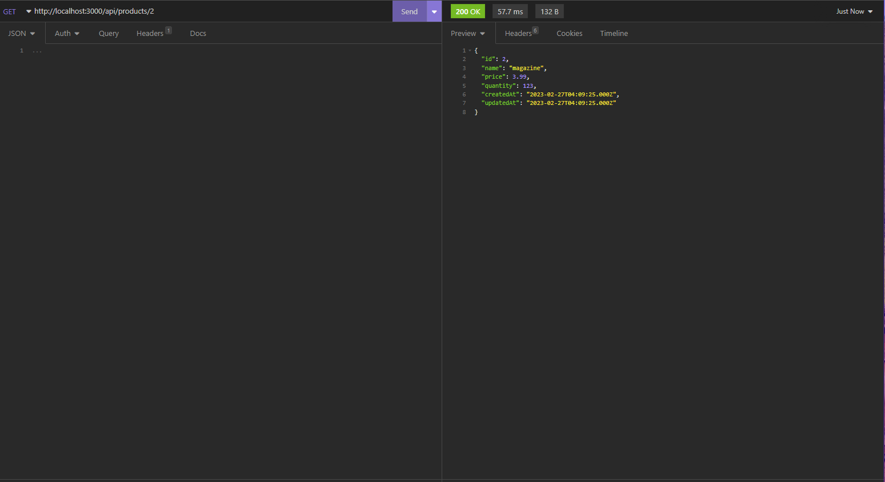
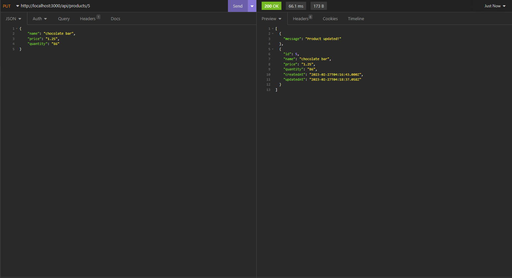

# Module: Microservices with Molecular

## Prerequisite Knowledge and Tools

In order to complete this module, learners must have familiarity with the following concepts:

* JavaScript in a Node.js environment

* Building a REST API with Node.js

* MySQL and the ORM Sequelize

* Docker Basics

  * Containers

  * Images

* API Testing with Insomnia

In order to complete this module, learners must have the following tools installed:

* Node.js & npm

* Docker Desktop or Docker Daemon

* MySQL Server (optionally can be run in a Docker container if no local installation is present)

* VSCode or code editor of choice

* Insomnia or another API testing tool

## Learning Objectives

By the end of this module, learners should be able to:

* Define the term microservices

* Compare the benefits and drawbacks of microservices

* Explain some key concepts of the Moleculer framework

* Explain the structure of a sample application

* Create a CRUD application using the Moleculer framework that implements the concepts of microservices

## Definition, Benefits, and Drawbacks of Microservices

A microservices architecture means that an application is composed of small, loosely coupled, and independent services. Services can be updated and changed without needing to redeploy the entire application.

Microservice architecture usually also includes the following:

* Node and Service Manager - This component places services on nodes, and identifies issues.

* API Gateway - This component serves as the entry point for clients and forwards calls to the appropriate services.

Some of the benefits of microservices include:

* Agility - Services can be updated without redeploying the entire application.

* Scalability - Services can be scaled independently allowing for resources to be used more efficiently.

* Fault Isolation - If one service fails it won't disrupt the entire application.

Some of the drawbacks of microservices include:

* Complexity - Individual services are simpler, but the system as a whole increases in complexity.

* Latency - Using many small services that implement multiple interservice calls can result in increased latency.

> [Read more about Microservice Architecture - Microsoft Azure Documentation](https://learn.microsoft.com/en-us/azure/architecture/guide/architecture-styles/microservices)

## Molecular Concepts

### Node

This is an OS process that can contain one or more services.

### Service Broker

This is required and manages communication between all services whether they are in the same node or in a separate node.

### Service

Services can exist in one or many nodes. If services exist in the same node, they are considered local to each other and can communicate without a transporter. If services exist in multiple nodes they are considered remote, and they must use a transporter.

### Transporter

This is responsible for exchanging messages across nodes and is required for remote services to communicate.

### Gateway

This is a Molecular service that serves as an API Gateway and maps incoming calls to the appropriate services.

> [Read more about Molecular Key Concepts - Moleculer Documentation](https://moleculer.services/docs/0.14/concepts.html)

## Application Structure

Our application will have three nodes with one service each:

* `node-1`

  * Gateway Service

* `node-2`

  * Products Service

* `node-3`

  * DB Service

Each node will also have a Service Broker.

Since the application services will be remote services, the application will need a Transporter. We will use a NATS server as the transporter.

The application structure will match the following image:


## Build Initial Application with a Gateway Service and Products Service

### Set Up Project

* Create a folder called `app` and a javascript file called `index.js`.

* Add a `package.json` within the `app` folder by running the `npm init` command using default values.

* Run the following command to add all necessary npm packages:

  ```bash
  npm i moleculer moleculer-db moleculer-db-adapter-sequelize moleculer-web mysql2 nats sequelize
  ```

### Configure NATS Server

Next, we will configure a NATS server to serve as the transporter which sends messages between nodes.

* To run a NATS Server that will be used as the transporter for our application, run the following Docker command (**Make sure that Docker Desktop is running before running this command!**):

  ```bash
  docker run -d -p 4222:4222 -p 8222:8222 -p 6222:6222 --name nats-server -ti nats:latest
  ```

* Make sure to keep this container running as the nodes must connect to it for communication.

### Create Node with Gateway Service

* First, add the following imports to the top of your `index.js` file (some of these will not be used until later):

  ```js
  // import service broker and web server
  const { ServiceBroker } = require("moleculer");
  const HTTPServer = require("moleculer-web");

  // import db service and adapter to user sequelize ORM
  const DbService = require("moleculer-db");
  const SqlAdapter = require("moleculer-db-adapter-sequelize");
  const { DataTypes } = require("sequelize");
  ```

* Next, add the following code to create a `ServiceBroker` in a node with the nodeID `node-1`:

  ```js
  // Create the broker for node with id "node-1" and use NATS as transporter
  const brokerNode1 = new ServiceBroker({
    nodeID: "node-1",
    transporter: "NATS"
  });
  ```

* Note that we have also defined the transporter here as `NATS`, which will use the NATS server that we started previously.

* Next, add the following code to configure our initial Gateway service:

  ```js
  // Create the "gateway" service in "node-1"
  brokerNode1.createService({
    name: "gateway",
    // properties present in the "HTTPServer" service are mixed in to our "gateway" service
    mixins: [HTTPServer],
    settings: {
      routes: [
        {
          // Add /api to base URL
          path: "/api",
          aliases: {
            // /api/products routes
            "GET /products": "products.listProducts"
          }
        }
      ]
    }
  });
  ```

* The `name` property gives our service a name that can be used when making service calls.

* Notice here that we have added `HTTPServer` to our `mixins` array. This means that this service will have all of the features from the `HTTPServer` service, which is the default export from `moleculer-web`. Any changes made after the `mixins` property will overwrite the existing configuration inherited from the mixed in service.

* We have also added a `routes` array to our `settings` object. By default, the base URL will be `http://localhost:3000`. We have added `/api` to the base path and set up an `action` that will be called when there is a request to `GET /api/products`. An `action` is a publicly callable method of a service. By specifying `products.listProducts`, we are saying call the `listProducts` action from the `products` service. The `listProducts` action and the `products` service have not yet been defined, we will do that next.

### Create Node with Initial Products Service

Add the following code to create a `ServiceBroker` for `node-2` and set up our initial `products` service:

```js
// Create the broker for node with id "node-2" and use NATS as transporter
const brokerNode2 = new ServiceBroker({
  nodeID:"node-2",
  transporter: "NATS"
});

// Create the "products" service in "node-2"
brokerNode2.createService({
  name:"products",
  // Define actions, which are public methods of the service that can be called externally
  actions: {
    // Called for our GET /api/products route
    listProducts(ctx) {
      return [
        { name: "baseball", price: 5.99, quantity: 100 },
        { name: "magazine", price: 3.99, quantity: 123 }
      ]
    }
  }
});
```

* Notice in our `actions` array that we have now defined the `listProducts` action. There is one parameter called `ctx`, which passes all of the contextual request information.

* Add the following code to the bottom of the `index.js`, and keep it at the bottom as you add more code in later steps:

  ```js
  // Start all brokers
  Promise.all([brokerNode1.start(), brokerNode2.start()]);
  ```

* This code starts both of our Service Brokers and starts the application.

* Run the application by running `node index.js` in the terminal.

* Open Insomnia and make a GET request to `http://localhost:3000/api/products`. You should see the following:


## Add and Integrate DB Service Using a Sequelize Adapter

### Set Up DB Service

* First add the following code to create a `ServiceBroker` for `node-3` and set up our `db` service:

  ```js
  // Create the broker for node with id "node-3" and use NATS as transporter
  const brokerNode3 = new ServiceBroker({
    nodeID: "node-3",
    transporter: "NATS"
  });

  // Create the "db" service in "node-3"
  brokerNode3.createService({
    name: "db",
    // properties present in the "DbService" are mixed in to our "db" service
    mixins: [DbService],
    // add in adapter for Sequelize and provide: db name, user name, password, and options object
    adapter: new SqlAdapter('shop_db', '<insert username>', '<insert password>', {
      host: 'localhost',
      dialect: 'mysql',
      dialectOptions: {
        decimalNumbers: true,
      },
    }),
    // define product model
    model: {
      name: "product",
      define: {
        id: {
          type: DataTypes.INTEGER,
          autoIncrement: true,
          primaryKey: true
        },
        name: DataTypes.STRING,
        price: DataTypes.DECIMAL(10,2),
        quantity: DataTypes.INTEGER
      }
    }
  })
  ```

  * Notice that we have added `DBService` as a `mixin` which is the default export of the `moleculer-db` package.

  * We are using the `SqlAdapter` which is the default export of the `moleculer-db-adapter-sequelize` package to create a Sequelize connection.

  * We have also defined the model that the db service will interact with in the `model` object.

### MySQL Configuration for an Existing Installation

* Make sure to replace `<insert username>` and `<insert password>` your MySQL username and password for your MySQL instance running on the default port `3306`.

* You will also need to create a db called `shop_db`.

  * To do so, do the following:

    * Log into the mysql CLI by entering in the terminal:

      ```bash
      mysql -u <insert username> -p
      ```

    * Enter password when prompted after issuing this command.

    * Type the following statement to create the database named `shop_db`:

      ```sql
      CREATE DATABASE shop_db;
      ```

    * To verify the creation, run the following statement:

      ```sql
      SHOW DATABASES;
      ```

### Optional MySQL Configuration with Docker

* If you do not have an installation of MySQL Server, follow these steps (**If you have already configured MySQL above, skip these steps!**):

  * Enter the following command in the terminal:

    ```bash
    docker run --name mysql -p 3306:3306 -e MYSQL_ROOT_PASSWORD=mysql -d mysql
    ```

  * Running the previous command has set the `root` user password to `mysql`.

  * Run the following command to open the mysql shell in the docker container:

    ```bash
    docker run -it --link mysql:mysql --rm mysql sh -c 'exec mysql -h"$MYSQL_PORT_3306_TCP_ADDR" -P"$MYSQL_PORT_3306_TCP_PORT" -uroot -p"$MYSQL_ENV_MYSQL_ROOT_PASSWORD"'
    ```

  * Type the following statement to create the database named `shop_db`:

    ```sql
    CREATE DATABASE shop_db;
    ```

  * To verify the creation, run the following statement:

    ```sql
    SHOW DATABASES;
    ```

  * Within `index.js`, make sure to replace the template `<insert username>` and `<insert password>` with `root` and `mysql` respectively.

### Integrate DB Service and Add Routes

* Update your Gateway service to look like the following:

  ```js
  brokerNode1.createService({
    name: "gateway",
    // properties present in the "HTTPServer" service are mixed in to our "gateway" service
    mixins: [HTTPServer],
    settings: {
      routes: [
        {
          // Add /api to base URL
          path: "/api",
          aliases: {
            // /api/products routes
            "GET /products": "products.listProducts",
            "GET /products/:id": "products.findProduct",
            "POST /products": "products.createProduct",
            "PUT /products/:id": "products.updateProduct",
            "DELETE /products/:id": "products.deleteProduct",
            "POST /products/seed": "products.seedProducts"
          }
        }
      ]
    }
  });
  ```

* We have added full CRUD routes as well as a seed route.

* Update your products service to look like the following:

  ```js
  brokerNode2.createService({
    name:"products",
    // Define actions, which are public methods of the service that can be called externally
    actions: {
      // Called for our GET /api/products route
      async listProducts(ctx) {
        const products = await brokerNode2.call("db.find");
        return products;
      },
      // Called for our GET /api/products/:id route
      async findProduct(ctx) {
        const product = await brokerNode2.call("db.get", { id: ctx.params.id });
        return product;
      },
      // Called for our POST /api/products route
      async createProduct(ctx) {
        const product = await brokerNode2.call("db.create", { name: ctx.params.name, price: ctx.params.price, quantity: ctx.params.quantity });
        return [ { message: "Product created!" }, product ];
      },
      // Called for our PUT /api/products/:id route
      async updateProduct(ctx) {
        const product = await brokerNode2.call("db.update", { id: ctx.params.id, name: ctx.params.name, price: ctx.params.price, quantity: ctx.params.quantity });
        return [ { message: "Product updated!" }, product ];
      },
      // Called for our DELETE /api/products/:id route
      async deleteProduct(ctx) {
        const product = await brokerNode2.call("db.remove", { id: ctx.params.id });
        return [ { message: "Product deleted!" }, product ];
      },
      // Called for our POST /api/products/seed route
      async seedProducts(ctx) {
        await brokerNode2.call("db.create", { name: "baseball", price: 5.99, quantity: 100 });
        await brokerNode2.call("db.create", { name: "magazine", price: 3.99, quantity: 123 });
        await brokerNode2.call("db.create", { name: "comb", price: 2.25, quantity: 1560 });
        await brokerNode2.call("db.create", { name: "hat", price: 10.99, quantity: 164 });
        return { message: "Products seeded!" };
      }
    },
    // Service will not start until "db" service is started
    dependencies: [
      "db"
    ]
  });
  ```

* Notice that we are using the `Context` object passed through the `ctx` parameter. By default, `ctx.params` includes both path variables and the request body so you can reference this object for either.

* We can use `async/await` syntax for `actions` to make our code cleaner.

* We can use the `call()` method to call actions from other services, here we are calling actions in the db that are inherited from the `mixin` in the service.

  * To refrence what methods are available from the `mixin` in the db service, look at the [Moleculer DB - Actions Documentation](https://moleculer.services/docs/0.14/moleculer-db.html#Actions)

* Notice we have a `dependencies` array, that specifies the `db` service as a dependency. This means that this service will not start until the `db` service has started.

* Update the code at the bottom of `index.js` to be:

  ```js
  // Start all brokers
  Promise.all([brokerNode1.start(), brokerNode2.start(), brokerNode3.start()]);
  ```

* Your complete code should be:

  ```js
  // import service broker and web server
  const { ServiceBroker } = require("moleculer");
  const HTTPServer = require("moleculer-web");

  // import db service and adapter to user sequelize ORM
  const DbService = require("moleculer-db");
  const SqlAdapter = require("moleculer-db-adapter-sequelize");
  const { DataTypes } = require("sequelize");


  // Create the broker for node with id "node-1" and use NATS as transporter
  const brokerNode1 = new ServiceBroker({
    nodeID: "node-1",
    transporter: "NATS"
  });

  // Create the "gateway" service in "node-1"
  brokerNode1.createService({
    name: "gateway",
    // properties present in the "HTTPServer" service are mixed in to our "gateway" service
    mixins: [HTTPServer],
    settings: {
      routes: [
        {
          // Add /api to base URL
          path: "/api",
          aliases: {
            // /api/products routes
            "GET /products": "products.listProducts",
            "GET /products/:id": "products.findProduct",
            "POST /products": "products.createProduct",
            "PUT /products/:id": "products.updateProduct",
            "DELETE /products/:id": "products.deleteProduct",
            "POST /products/seed": "products.seedProducts"
          }
        }
      ]
    }
  });

  // Create the broker for node with id "node-2" and use NATS as transporter
  const brokerNode2 = new ServiceBroker({
    nodeID:"node-2",
    transporter: "NATS"
  });

  // Create the "products" service in "node-2"
  brokerNode2.createService({
    name:"products",
    // Define actions, which are public methods of the service that can be called externally
    actions: {
      // Called for our GET /api/products route
      async listProducts(ctx) {
        const products = await brokerNode2.call("db.find");
        return products;
      },
      // Called for our GET /api/products/:id route
      async findProduct(ctx) {
        const product = await brokerNode2.call("db.get", { id: ctx.params.id });
        return product;
      },
      // Called for our POST /api/products route
      async createProduct(ctx) {
        const product = await brokerNode2.call("db.create", { name: ctx.params.name, price: ctx.params.price, quantity: ctx.params.quantity });
        return [ { message: "Product created!" }, product ];
      },
      // Called for our PUT /api/products/:id route
      async updateProduct(ctx) {
        const product = await brokerNode2.call("db.update", { id: ctx.params.id, name: ctx.params.name, price: ctx.params.price, quantity: ctx.params.quantity });
        return [ { message: "Product updated!" }, product ];
      },
      // Called for our DELETE /api/products/:id route
      async deleteProduct(ctx) {
        const product = await brokerNode2.call("db.remove", { id: ctx.params.id });
        return [ { message: "Product deleted!" }, product ];
      },
      // Called for our POST /api/products/seed route
      async seedProducts(ctx) {
        await brokerNode2.call("db.create", { name: "baseball", price: 5.99, quantity: 100 });
        await brokerNode2.call("db.create", { name: "magazine", price: 3.99, quantity: 123 });
        await brokerNode2.call("db.create", { name: "comb", price: 2.25, quantity: 1560 });
        await brokerNode2.call("db.create", { name: "hat", price: 10.99, quantity: 164 });
        return { message: "Products seeded!" };
      }
    },
    // Service will not start until "db" service is started
    dependencies: [
      "db"
    ]
  });

  // Create the broker for node with id "node-3" and use NATS as transporter
  const brokerNode3 = new ServiceBroker({
    nodeID: "node-3",
    transporter: "NATS"
  });

  // Create the "db" service in "node-3"
  brokerNode3.createService({
    name: "db",
    // properties present in the "DbService" are mixed in to our "db" service
    mixins: [DbService],
    // add in adapter for Sequelize and provide: db name, user name, password, and options object
    adapter: new SqlAdapter('shop_db', '<insert username>', '<insert password>', {
      host: 'localhost',
      dialect: 'mysql',
      dialectOptions: {
        decimalNumbers: true,
      },
    }),
    // define product model
    model: {
      name: "product",
      define: {
        id: {
          type: DataTypes.INTEGER,
          autoIncrement: true,
          primaryKey: true
        },
        name: DataTypes.STRING,
        price: DataTypes.DECIMAL(10,2),
        quantity: DataTypes.INTEGER
      }
    }
  })

  // Start all brokers
  Promise.all([brokerNode1.start(), brokerNode2.start(), brokerNode3.start()]);
  ```

### Running and Exercising the API

* Run `node index.js` to run the app

* The Gateway Service should listen by default at port `3000` and is available at `http://localhost:3000`.

* The available routes are:

  ```txt
  GET /api/products
  GET /api/products/:id
  POST /api/products
  PUT /api/products/:id
  DELETE /api/products/:id
  POST /api/products/seed
  ```

* Feel free to seed the database and try out the routes.

* Refer to the example calls below:

  * POST /api/products/seed

    

  * GET /api/products/

    

  * GET /api/products/:id

    

  * POST /api/products

    

  * PUT /api/products/:id

    

  * DELETE /api/products/:id

    

### Stop and Remove Containers and Images

When finished with the app, use the following steps to clean up Docker resources.

**If you used a local installation of MySQL, you can omit the `mysql` argument in all commands below**

* To stop the containers used by this app, run the following command:

  ```bash
  docker stop mysql nats-server
  ```

* To remove the containers created, run the following command:

  ```bash
  docker rm mysql nats-server
  ```

* To remove the images, run the following command:

  ```bash
  docker rmi mysql nats
  ```

## Recap

Great job completing this module! You learned what microservices are and some of the benefits and drawbacks of using microservice architecture. You looked at some of the core concepts of the Moleculer framework. You finished off the module with a hands-on build of a CRUD app made up of a gateway service, a products service, and a db service each running on their own node.
